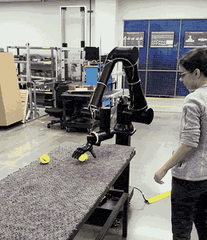

# DexterousCobot

Autonomous tennis-ball pickup with a Standard Bots RO1 arm, a PSYONIC Ability
Hand, and an eye-in-hand RealSense depth camera. The robot watches for a ball,
waits until it is stationary inside a taught region, drives to it with
continuous vision-based retargeting, grasps it, carries it home, and drops it.



Three consecutive pickup cycles, sped up ~2x and heavily compressed to keep the
file small. Same run at full quality and real-time speed:
[media/demo.mp4](media/demo.mp4)

## Hardware

- Standard Bots RO1 — 6-DoF collaborative arm, driven over its HTTP API
- PSYONIC Ability Hand — 6-DoF gripper, driven over serial
- Intel RealSense D415 — RGB-D camera, mounted eye-in-hand on the wrist
- Raspberry Pi host, on the same LAN as the robot controller

## Stack

- Python 3.10+
- `standardbots` — arm SDK (joint/tooltip targets, brakes, control mode)
- `ability-hand` (`ah_wrapper.AHSerialClient`) — hand SDK; a write thread
  re-streams the target at `rate_hz`, since the hand reverts to its firmware
  default grip if commands stop arriving
- `pyrealsense2` — color + depth streams, manual UVC exposure/white-balance
- `opencv-python` — HSV masking, morphology, contour and circle fitting,
  checkerboard detection for calibration
- `numpy` — transforms, Kalman filter, closed-form IK
- `matplotlib` — debug plots
- ROS 2 Humble + `rclpy` + CycloneDDS, in Docker — an alternative real-time
  path to the arm's joint-state and pose topics (`ROSrealtime/`)

## Pipeline

`combinedtest.py` is the whole autonomous routine. Per vision tick:

1. Grab an RGB frame and the arm pose back to back (no hardware sync, so the
   reads are kept adjacent to minimize skew).
2. Threshold the frame in HSV, open/close to kill speckle, take the largest
   contour, gate on circularity, and fit a minimum enclosing circle. Balls
   clipped by the frame edge are rejected.
3. Range the ball from its apparent size (`fx * D / d_px`) using the known
   67.5 mm diameter. The stereo-depth path exists but is disabled — it was not
   accurate enough at the working distance.
4. Transform camera → tooltip via the hand-eye extrinsics (`camInTooltip.npy`),
   then tooltip → base via the reported arm pose.
5. Fold the base-frame measurement into a zero-velocity (random-walk) Kalman
   filter. On a miss the estimate coasts instead of jumping.
6. Solve joints analytically: the wrist is pinned level (`J1+J2+J3 = 180°`,
   `J4 = -270°`, `J5 = 180°`), which reduces the arm to a lateral-offset
   shoulder plus planar two-link IK. Of the up-to-four solutions, the one
   closest to the current pose wins.
7. Re-send the target whenever the estimate moves more than 2°, so the arm
   keeps refining as the camera closes in and can follow a ball moved
   mid-approach. Grasp on arrival, deliver home, release.

Arm geometry constants were fitted against the robot's own forward kinematics
over a 36-pose grid; in-plane residual is under 3 µm, and the ~3 mm lateral
wobble across the workspace is the accuracy floor of the model.

## Setup

```
python3 -m venv .venv
.venv/bin/pip install -r requirements.txt
```

The arm URL and API token path are set at the top of each script — the token
is read from a file outside the repo. Point them at your controller.

## Development process

Bring-up is a sequence of calibration and teaching steps, each with its own
script and each writing an artifact the main routine loads at import:

| Step | Script | Produces |
| --- | --- | --- |
| 1. Verify connection, brakes, control mode | `testConnection.py`, `testbrakething.py`, `main.py` | — |
| 2. Calibrate hand-eye extrinsics | `calibrate_handeye.py --square 0.025` | `camInTooltip.npy` |
| 3. Tune the HSV ball threshold | `tune_ball_color.py` | `ballColor` in `combinedtest.py` |
| 4. Teach the valid pickup region | `collect_ball_region.py` | `ballRegion.json` |
| 5. Run the routine | `combinedtest.py` | — |

Debug helpers:

- `debug_ball_frames.py` — prints the ball position in the camera, tooltip,
  tool-point, and base frames at once, so a bad link in the transform chain
  can be isolated (drift that grows with arm rotation means recalibrate).
- `check_preemption.py` — probes whether `set_arm_position` preempts, queues,
  or rejects a target sent mid-motion. There is no cancel endpoint, so this
  determines the retargeting latency.
- `camera.py`, `cameramera.py` — single frame grab and MJPEG stream capture.
- `manual_control.py` — keyboard jog for the hand, usable over SSH.
- `hand_wave.py` — hand motion smoke test.

While waiting for a ball the routine writes `frame.jpeg` (camera view) and
`filtered.jpeg` (mask with the fitted circle drawn) next to itself, so the
detector can be watched from a remote shell.

Calibration scripts never command motion — you jog the arm yourself from the
Standard Bots interface, and a capture is rejected if the arm moved during it.

### ROS 2 path

`ROSrealtime/` is a containerized alternative to the HTTP SDK, used to get
real-time joint states and pose streaming off the robot's DDS topics.

```
cd ROSrealtime
./build.sh                                   # build the image
./run.sh                                     # read joint states
./run.sh "python3 ./src/write_poses.py ..."  # replay poses
./run_shell.sh                               # interactive shell
```

It runs `--net=host` with CycloneDDS on `ROS_DOMAIN_ID=1`, discovers the bot ID
from the published topic names, and carries URDFs for the RO1 variants
(`core`, `spark`, `thor`).

## Safety

The routine commands real motion; `routineSpeedScale` in `combinedtest.py`
scales the speed profile and is currently 1.0. Keep the workspace clear and
stay near the e-stop. `ArmClient` re-engages the brakes on exit,
including on exceptions. The release sequence deliberately opens, closes, and
opens again — gripping can trip a finger's current limit and soft-lock it, and
driving every finger both directions clears the lock before the next grasp.
